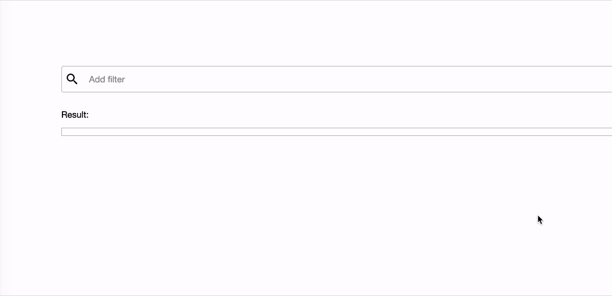

ember-visual-search
==============================================================================

A Powerful Visual Search Box Addon - Demo: https://edhuardotierrez.github.io/ember-visual-search/



#### Resulted facets (json object): 
```json
[
    {
        "id": 1,
        "key": "website", 
        "value": "Google",
        "title": "Website"
    }
]
```

# 
Installation
------------------------------------------------------------------------------

```
ember install ember-visual-search
```


Usage
------------------------------------------------------------------------------

#### Template:
```handlebars
{{visual-search
    options=myOptions
    onSearchButton=(action 'onSearchButton')
    onChange=(action 'onChange')
    defaultKey='search'
    getKeyValues=getKeyValuesFunc
    onCreateFacet=(action 'onCreateFacet')
    suggestOnFocus=(hash keys=true values=true)
    ... 
}}
```

#### Controller:
```javascript
export default Controller.extend({
  // ...
    myOptions: {
      keys: [
        {
          key: 'website',
          title: 'Website',
        },
        {
          key: 'extension',
          title: 'Extension',
        }]
    },

    getKeyValuesFunc(facet){

        if(facet.key === 'website')
            return ['Facebook.com', 'Google.com', ...];

        if(facet.key === 'extension')
            return ['com', 'org', ...];

        // default
        return [];
    },

    actions: {
        onSearchButton(){ 
        },
        // on change any data
        onChange(facets){
        },
        // on change a facet
        onCreateFacet(facet){
        }
    }
  // ...
```

### See more on demo page: https://edhuardotierrez.github.io/ember-visual-search/


Contributing
------------------------------------------------------------------------------

### Installation

* `git clone <repository-url>`
* `cd ember-visual-search`
* `npm install`

### Linting

* `npm run lint:js`
* `npm run lint:js -- --fix`

### Running tests

* `ember test` – Runs the test suite on the current Ember version
* `ember test --server` – Runs the test suite in "watch mode"
* `ember try:each` – Runs the test suite against multiple Ember versions

### Running the dummy application

* `ember serve`
* Visit the dummy application at [http://localhost:4200](http://localhost:4200).

For more information on using ember-cli, visit [https://ember-cli.com/](https://ember-cli.com/).

License
------------------------------------------------------------------------------

This project is licensed under the [MIT License](LICENSE).
